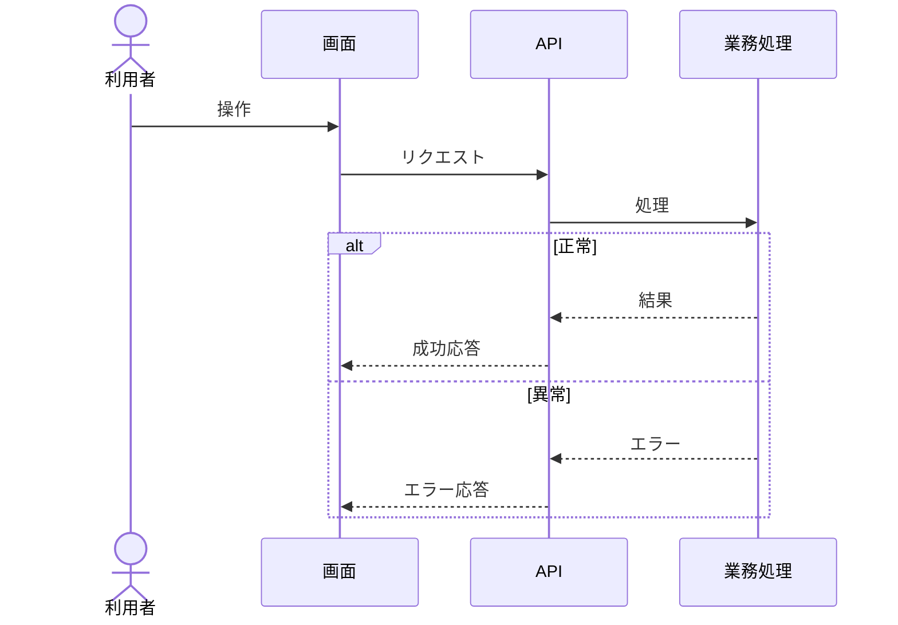

# Issue下書きテンプレート

画面実装Issueは画面ごとに1つだけ作り、次の形式を使う。フロントエンド、バックエンド、API、テストを分離した子Issueにしない。

```markdown
## <画面名>を実装する

- 種別: `<type>`
- ラベル: `<type:...>`, `<domain:...>`, `<screen:...>`
- 親Issue: なし
- 子Issue: なし

### 何を構築するか

### ドメイン・配置・ファイル分割

### APIと画面のシーケンス



### 受け入れ基準

### テスト観点と項目

| 観点 | テスト種別 | 入力・操作 | 期待結果 | 実行コマンド |
| --- | --- | --- | --- | --- |

### 検証の完了条件
```

APIを追加・変更しない画面では、`### APIと画面のシーケンス` に「追加・変更するAPIなし」と理由を書く。テストの各観点についても、非該当なら理由を記載する。

整備Issueでは、1つの関心だけを扱い、次を記載する。

```markdown
## <整備する関心>を定める

- 種別: `maintenance`
- ラベル: <既存規約がある場合だけ記載>
- 親Issue: なし
- 子Issue: なし
- 対象層: `<frontend|backend|persistence|cross-layer|operations>`
- 依存する決定: `<Issue IDまたはなし>`
- 実ディレクトリへの影響: <決定後に確定する設定ファイル・コード種別・配置>

### 何を構築するか

### 受け入れ基準

### 完了後の扱い

このIssueの承認・実施・再調査が済むまで、画面実装とAPIのタスク分解を行わない。
```

`cross-layer` では、単一層へ帰属できない理由を本文へ記載する。同一層のディレクトリ配置とファイル責務を統合する場合は、相互依存する理由を本文へ記載する。分離する場合は、独立して変更・レビューできる根拠を本文へ記載する。
